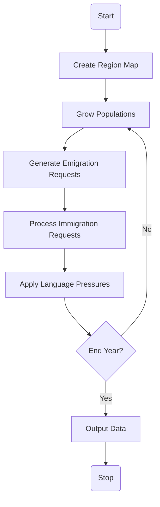

# Language Distribution Predictor
__Author:__ Jacob Lindey  
__Created:__ July 19, 2019  
__Update:__ July 22, 2019  
__Ended:__

## Overview
The Language Distribution Predictor (LDP) is a tool I originally designed for
the MCM 2018 competition in conjunction with William Davis and Christopher
Ligato at Slippery Rock University.
It predicts the language distributions throughout a given set of regions after a
set amount of time.

I'm revisiting this project nearly two years after its initial development to
see what I've learned and bit of extra time can do.
This updated version will include:
  * Cleaner Code
  * Optimization Considerations
  * A User Interface
  * Data Visualization

While the original project was a collaboration, this is a solo project.
All code within was written by myself.

## User Interface
The user interface will have:
  - a world map representing language distributions, updated in real time
    - positioned to the right side, taking up the majority of the screen
  - sliders for adjusting parameters
    - positioned to the left side bar
    - both slider and text entry
  - *stretch goal:* buttons for image export and time-lapse creation

## Functionality
The LDP is a deterministic system based on a diffusion reaction model in two
dimensions.

Every simulation cycle (representing one standardized time unit, typically a
year) the speaking population for each language in each region (country) is
adjusted based on births/deaths, immigration/emigration, and new learners who
have achieved fluency.

### System Design

## Milestones
A list of planned development milestones follows, divided into four stages.

### Minimally Viable Product
  - [x] refactor backend
  - [x] single stage visualization
  - [x] Prerelease to GitHub
  - [x] File Output
  - [x] Release to GitHub

### Revisit
If I revisit this project after release these are the features I'm interested in
adding.
  - [ ] Adjustable parameters with sliders
  - [ ] Real time visualization with parameter changes
  - [ ] Rerelease to GitHub

### Stretch Goal
These features may never see the light of day.
May come after a long break.
Depends on my ongoing interest in the project.
  - [ ] Multi-year visualizations
  - [ ] Language Pressures
  - [ ] Export visuals
  - [ ] Export animated visuals
  - [ ] Rerelease to GitHub
